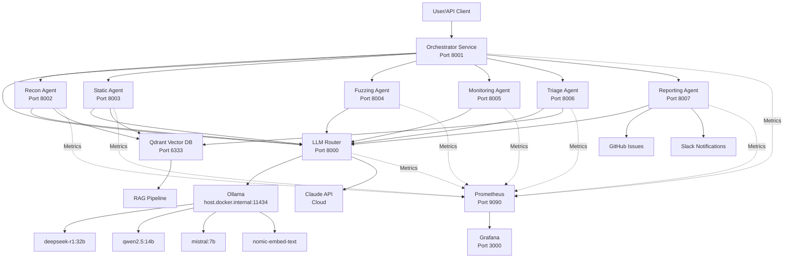

# System Architecture

## Overview

The Web3 Bug Bounty Automation System is a microservices-based security platform that orchestrates multiple specialized agents to perform comprehensive smart contract security analysis.

## Architecture Diagram



## Component Details

### Orchestrator Service

**Purpose**: Central pipeline controller that coordinates all agents sequentially.

**Responsibilities**:
- Accept scan requests from users
- Execute agents in sequence: Recon → Static → Fuzzing → Monitoring → Triage → Reporting
- Manage scan state and progress
- Handle errors and retries
- Provide scan status API

**Technology**: FastAPI, Python 3.11

**Key Design Decisions**:
- Sequential execution prevents VRAM overflow (only one model loaded at a time)
- Async/await for non-blocking I/O
- In-memory state (use Redis for production)

### LLM Router Service

**Purpose**: Intelligent routing of LLM requests to appropriate backends.

**Routing Strategy**:
```yaml
Task Type              → Model                    → Backend
─────────────────────────────────────────────────────────────
smart_contract_analysis → deepseek-r1:32b        → Ollama (local)
code_review            → qwen2.5:14b            → Ollama (local)
fast_triage            → mistral:7b             → Ollama (local)
embeddings             → nomic-embed-text       → Ollama (local)
final_report           → claude-4.5-sonnet      → Anthropic (cloud)
```

**Why Hybrid?**:
- **Cost**: Local models are free, Claude costs ~$0.01-0.10 per request
- **Speed**: Local models respond in 2-10s, Claude in 5-15s
- **Quality**: Claude excels at final synthesis and report writing
- **Privacy**: Sensitive code analysis stays local

### Agent Services

#### 1. Recon Agent (Port 8002)

**Capabilities**:
- Clone Git repositories
- Analyze project structure (Solidity, Vyper, Rust contracts)
- Extract ABIs from verified contracts (Etherscan, BSCScan, etc.)
- DNS/ENS enumeration
- RPC endpoint discovery
- Frontend/backend mapping

**Output**: Repository structure, contract source code, ABIs, surface map

#### 2. Static Analysis Agent (Port 8003)

**Tools Integrated**:
- **Slither**: Solidity static analyzer (70+ detectors)
- **Mythril**: Symbolic execution engine
- **Semgrep**: Custom pattern matching

**Process**:
1. Write contracts to temp directory
2. Run Slither, Mythril, Semgrep in parallel
3. Aggregate findings
4. Use LLM (Qwen) to summarize and prioritize

**Output**: Categorized vulnerabilities with severity ratings

#### 3. Fuzzing Agent (Port 8004)

**Capabilities**:
- Generate Foundry fuzz tests using LLM
- Run Foundry test suite
- ABI-based input mutation
- Coverage analysis
- Counterexample extraction

**Process**:
1. LLM generates fuzz tests for each contract
2. Initialize Foundry project
3. Run `forge test` with fuzzing enabled
4. Collect failures and counterexamples

**Output**: Failed tests, counterexamples, coverage metrics

#### 4. Monitoring Agent (Port 8005)

**Capabilities**:
- Mempool transaction monitoring
- Oracle price deviation detection
- RPC endpoint drift detection
- DNS/ENS hash monitoring

**Process**:
1. Connect to RPC endpoint
2. Monitor pending transactions for target contract
3. Detect anomalies (large transfers, unusual patterns)
4. Compare oracle prices across sources

**Output**: Anomaly reports, suspicious transactions

#### 5. Triage Agent (Port 8006)

**Three-Tier Classification**:

**Tier 1: Fast Triage (Mistral 7B)**
- Quick classification of all findings
- Filter out obvious false positives
- Assign initial severity
- ~1-2s per finding

**Tier 2: Deep Reasoning (DeepSeek-R1 32B)**
- Detailed analysis of high-priority findings
- Root cause analysis
- Exploitability assessment
- Attack scenario generation
- ~5-10s per finding

**Tier 3: Final Classification (Claude 4.5)**
- Professional report generation
- CVSS scoring
- Immunefi/HackenProof formatting
- Safe reproduction steps
- ~10-15s per finding

**Output**: Validated vulnerabilities with professional reports

#### 6. Reporting Agent (Port 8007)

**Capabilities**:
- Generate Immunefi-formatted reports
- Generate HackenProof-formatted reports
- Create JSON exports
- Create private GitHub issues
- Send Slack notifications
- Email notifications (optional)

**Templates**: Jinja2-based, customizable

**Output**: Multiple report formats, notifications sent

### RAG Pipeline

**Purpose**: Enhance analysis with historical vulnerability knowledge.

**Components**:

1. **Embedder** (`src/rag/embedder.py`)
   - Uses nomic-embed-text (768-dim embeddings)
   - Batch processing for efficiency

2. **Indexer** (`src/rag/indexer.py`)
   - Three Qdrant collections:
     - `web3_contracts`: Indexed contract code
     - `web3_vulnerabilities`: Historical findings
     - `web3_documentation`: Security docs
   - Cosine similarity search

3. **Query Engine** (`src/rag/query.py`)
   - Semantic search across collections
   - Context retrieval for triage
   - Similar vulnerability matching

**Use Cases**:
- Find similar past vulnerabilities
- Retrieve relevant documentation
- Pattern matching for known exploits

### Monitoring Stack

**Prometheus**:
- Scrapes metrics from all services every 15s
- Stores time-series data
- Provides query interface

**Grafana**:
- Pre-built dashboard for system overview
- Visualizes:
  - Active scans
  - LLM request rates
  - Agent errors
  - Scan duration (p50, p95)
  - Model usage distribution

## Data Flow

### Complete Scan Pipeline

```
1. User submits scan request
   ↓
2. Orchestrator creates scan record
   ↓
3. Recon Agent:
   - Clones repository
   - Extracts contracts and ABIs
   - Maps attack surface
   ↓
4. Static Agent:
   - Runs Slither, Mythril, Semgrep
   - AI summarization
   ↓
5. Fuzzing Agent:
   - Generates fuzz tests
   - Runs Foundry
   - Collects failures
   ↓
6. Monitoring Agent:
   - Monitors mempool (5 min)
   - Checks oracles
   - Detects RPC drift
   ↓
7. Triage Agent:
   - Tier 1: Fast filter (Mistral)
   - Tier 2: Deep analysis (DeepSeek)
   - Tier 3: Final reports (Claude)
   ↓
8. Reporting Agent:
   - Generates Immunefi report
   - Generates HackenProof report
   - Creates GitHub issue
   - Sends Slack notification
   ↓
9. User retrieves results
```

## Windows-Specific Architecture

### Ollama Integration

**Challenge**: Docker containers can't access `localhost` on Windows host.

**Solution**: Use `host.docker.internal` DNS name.

```
Docker Container (Linux)
  ↓
  HTTP Request to http://host.docker.internal:11434
  ↓
Windows Docker Desktop (WSL2 Bridge)
  ↓
Windows Host (localhost:11434)
  ↓
Ollama Service (Native Windows)
```

### GPU Acceleration

**DirectML**: Ollama on Windows uses DirectML for GPU acceleration.
- No CUDA required
- Works with any DirectX 12 compatible GPU
- Automatic - no configuration needed

**VRAM Management**:
- Models load on-demand
- Sequential execution prevents multi-model VRAM usage
- Ollama automatically unloads unused models

## Security Considerations

### Network Isolation

- All services communicate via internal Docker network
- Only Orchestrator exposed to external network
- LLM Router not directly accessible

### Secrets Management

- Environment variables for API keys
- No secrets in Docker images
- `.env` file excluded from Git

### Safe Reproduction

- Triage agent generates **safe** reproduction steps
- No actual exploitation code
- Fork-only testing recommended

## Scalability

### Current Limitations

- In-memory scan storage (use Redis for production)
- Single-instance agents (no horizontal scaling)
- Sequential execution (one scan at a time)

### Production Enhancements

1. **Redis** for distributed state
2. **Kubernetes** for orchestration
3. **Message queue** (RabbitMQ) for async processing
4. **Multiple agent instances** with load balancing
5. **Persistent storage** for reports (S3, MinIO)

## Performance Characteristics

### Typical Scan Duration

- **Small project** (1-2 contracts): 5-10 minutes
- **Medium project** (5-10 contracts): 15-30 minutes
- **Large project** (20+ contracts): 45-90 minutes

### Bottlenecks

1. **Fuzzing**: Longest stage (5-15 min per contract)
2. **Deep reasoning**: DeepSeek-R1 32B (5-10s per finding)
3. **Repository cloning**: Network dependent

### Optimization Strategies

- Skip fuzzing for simple contracts
- Limit deep reasoning to critical findings
- Cache repository clones
- Parallel static analysis tools

## Technology Stack

| Component | Technology | Version |
|-----------|-----------|---------|
| Container Runtime | Docker Desktop | Latest |
| Orchestration | Docker Compose | v2.x |
| Services | FastAPI + Uvicorn | 0.109.0 |
| LLM (Local) | Ollama | Latest |
| LLM (Cloud) | Claude 4.5 | Latest |
| Vector DB | Qdrant | Latest |
| Monitoring | Prometheus + Grafana | Latest |
| Static Analysis | Slither, Mythril, Semgrep | Latest |
| Fuzzing | Foundry | Latest |
| Language | Python | 3.11 |

## Future Enhancements

1. **Additional Chains**: Solana, Cosmos, Polkadot support
2. **More Fuzzers**: Echidna, Manticore integration
3. **Formal Verification**: Certora, K Framework
4. **ML Models**: Custom vulnerability detection models
5. **Web UI**: Dashboard for scan management
6. **API Gateway**: Rate limiting, authentication
7. **Webhook Support**: Real-time notifications
