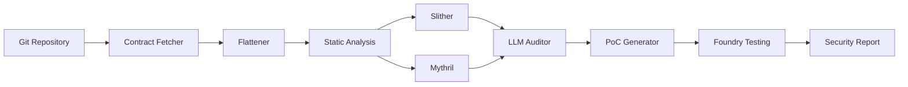

# Web3 Hunter - Project README

## Overview

**Web3 Hunter** is an automated bug bounty system for smart contracts that leverages AI and static analysis tools to identify vulnerabilities, generate proof-of-concept exploits, and create comprehensive security reports.

## Architecture



## Features

- 🔍 **Automated Contract Analysis** - Fetches and analyzes smart contracts from Git repositories
- 🛡️ **Multi-Tool Security Scanning** - Integrates Slither and Mythril for comprehensive analysis
- 🤖 **AI-Powered Auditing** - Uses LLMs (Ollama/OpenAI) for intelligent vulnerability assessment
- 📊 **Knowledge Base (RAG)** - Vector store for contextual vulnerability pattern matching
- ⚡ **Exploit Generation** - Automatically generates PoC code for discovered vulnerabilities
- ✅ **Verification** - Tests exploits using Foundry framework
- 📋 **Detailed Reporting** - Generates comprehensive security reports

## Tech Stack

- **Orchestration**: LangGraph (workflow state machine)
- **LLM**: Ollama (GPU-accelerated local inference) / OpenAI API
- **Static Analysis**: Slither, Mythril
- **Testing**: Foundry (forge, cast, anvil)
- **Vector Store**: LangChain Community (for RAG)
- **Language**: Python 3.10+

## Quick Start

### Prerequisites

- Python 3.10 or higher
- Git
- Windows with GPU support (for optimal LLM performance)

### Installation

See [WINDOWS_SETUP.md](file:///c:/Users/patel/Desktop/web3_hunter/WINDOWS_SETUP.md) for detailed setup instructions.

```powershell
# Clone and setup
cd c:\Users\patel\Desktop\web3_hunter
.\venv\Scripts\Activate.ps1
pip install -r requirements.txt

# Install blockchain tools
pip install solc-select
solc-select install 0.8.20
solc-select use 0.8.20

# Install Foundry
# Download from: https://getfoundry.sh

# Setup LLM backend (Ollama)
ollama pull codellama:13b
```

### Usage

```powershell
python main.py https://github.com/your-target/smart-contract-repo
```

## Configuration

Edit `config/settings.yaml` to customize:

```yaml
llm:
  provider: "ollama"  # or "openai"
  model: "codellama:13b"
  temperature: 0.1

tools:
  slither:
    enabled: true
  mythril:
    enabled: true
  foundry:
    enabled: true
```

## Project Structure

```
web3_hunter/
├── config/               # Configuration files
│   └── settings.yaml
├── data/                # Data storage
│   └── vector_db/      # RAG vector database
├── src/
│   ├── analysis/       # Slither, Mythril, LLM auditor
│   ├── ingestion/      # Git fetch, flattening, call graphs
│   ├── knowledge/      # Vector store for RAG
│   ├── orchestration/  # LangGraph workflow engine
│   └── verification/   # PoC generation, Foundry testing
├── tests/              # Unit and integration tests
├── main.py            # Entry point
└── requirements.txt   # Python dependencies
```

## Workflow

1. **Fetch**: Clone target repository and locate Solidity contracts
2. **Flatten**: Combine contract files and resolve imports
3. **Analyze**: Run Slither + Mythril + LLM analysis
4. **Generate**: Create PoC exploits for discovered vulnerabilities
5. **Verify**: Test exploits using Foundry
6. **Report**: Generate comprehensive security report

## Development

See [ROADMAP.md](file:///c:/Users/patel/Desktop/web3_hunter/ROADMAP.md) for development phases and planned features.

### Current Status

- ✅ Core workflow orchestration
- ✅ Slither integration
- ✅ LLM auditor
- ✅ Vector store (RAG)
- ⚠️ Mythril integration (partial)
- ⚠️ Foundry testing (partial)
- ⚠️ Contract flattening (partial)

### Running Tests

```powershell
python -m pytest tests/
```

## GPU Acceleration

This project is optimized for Windows with GPU support to accelerate LLM inference:

- **Ollama**: Automatically utilizes GPU when available
- **Monitor GPU usage**: Task Manager → Performance → GPU
- **Model recommendations**:
  - Fast: `llama2:7b`
  - Balanced: `codellama:13b`
  - Best: `codellama:34b` (requires 24GB+ VRAM)

## Documentation

- [WINDOWS_SETUP.md](file:///c:/Users/patel/Desktop/web3_hunter/WINDOWS_SETUP.md) - Windows installation guide
- [ROADMAP.md](file:///c:/Users/patel/Desktop/web3_hunter/ROADMAP.md) - Development roadmap
- [implementation_plan.md](file:///C:/Users/patel/.gemini/antigravity/brain/d3855fbc-1d9f-4f8a-8f0f-c80dfb322305/implementation_plan.md) - Detailed implementation plan

## Contributing

This is a personal bug bounty automation project. Contributions, suggestions, and feedback are welcome.

## Resources

- **Slither**: https://github.com/crytic/slither
- **Mythril**: https://github.com/ConsenSys/mythril
- **Foundry**: https://book.getfoundry.sh/
- **LangGraph**: https://langchain-ai.github.io/langgraph/
- **Ollama**: https://ollama.ai/

## License

[Specify your license here]

---

**Note**: This tool is for educational and authorized security research purposes only. Always obtain proper authorization before testing smart contracts.
